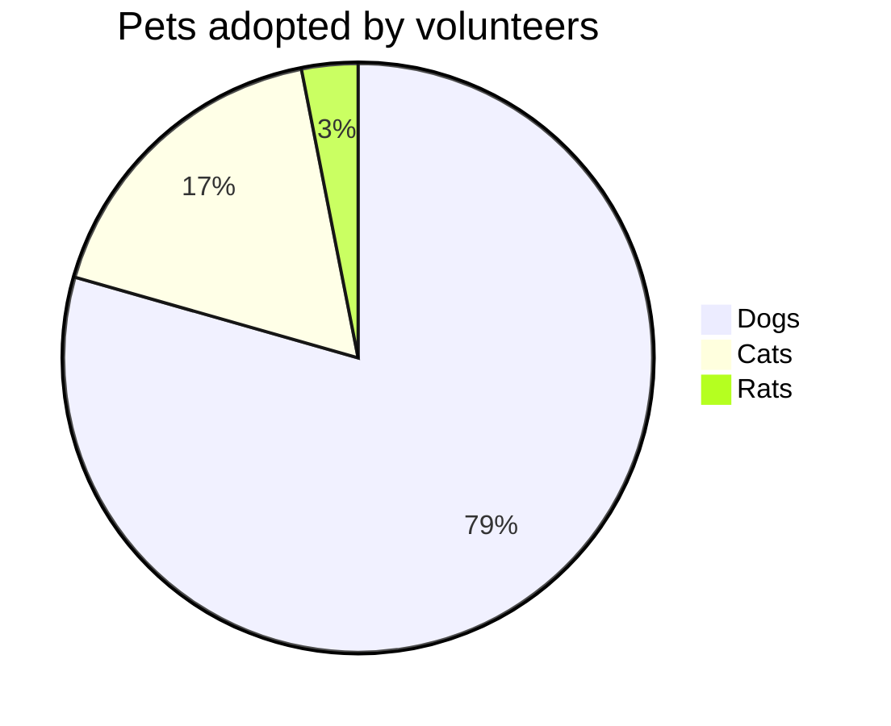

Probando, probando...Esta es la primera entrada del blog, donde quiero presentar el contenido que incluiré de aquí en adelante.

<!--more-->

En este blog voy a ir subiendo el contenido que me apetezca, principalmente sobre el trabajo en mi tesis, pero no descarto incluir otros proyectos.

Aprovecharé los recursos que ofrece este tema de Jekyll (que es [TeXt](https://tianqi.name/jekyll-TeXt-theme), por cierto), ya que permiten usara una gran cantidad de recursos:
- La inserción de ecuaciones. En línea $f(x)=x^2$ o a parte: 

$$\oint_C \vec {E} \cdot \mathrm {d} \vec {\ell} = - \frac {\mathrm {d}}{\mathrm {d} t} \int_S \vec {B} \cdot \mathrm {d} \vec {S}$$

- Mapas mentales:

