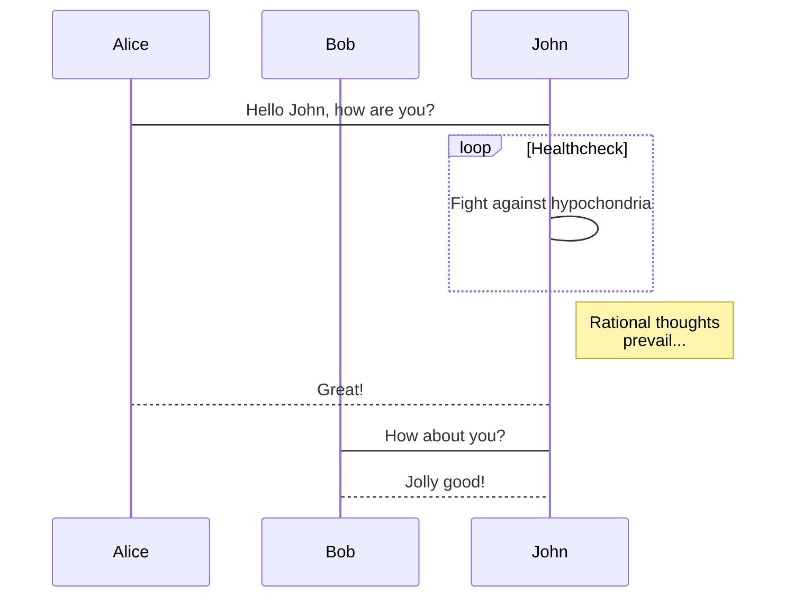

Probando, probando...Esta es la primera entrada del blog, donde quiero presentar los recursos que usaré en adelante.

<!--more-->


En este blog voy a ir subiendo el contenido que me apetezca, principalmente sobre el trabajo en mi tesis, pero no descarto incluir otros proyectos.

Aprovecharé los recursos que ofrece este tema de Jekyll (que es [TeXt](https://tianqi.name/jekyll-TeXt-theme), por cierto), ya que permiten usara una gran cantidad de recursos:
- La inserción de ecuaciones. En línea $f(x)=x^2$ o a parte: 

$$\oint_C \vec {E} \cdot \mathrm {d} \vec {\ell} = - \frac {\mathrm {d}}{\mathrm {d} t} \int_S \vec {B} \cdot \mathrm {d} \vec {S}$$

- Código:
```python
>>># Initialize the list
>>>weekdays = ["Sunday", "Monday", "Tuesday","Wednesday", "Thursday","Friday", "Saturday"]
>>>print("Seven Weekdays are:\n")
>>># Iterate the list using for loop
>>>for day in range(len(weekdays)):
...    print(weekdays[day])
Seven Weekdays are:
Sunday
Monday
Tuesday
Wedneday
Thursday
Friday
Saturday
```

- Gráficos:
```chart
{
  "type": "line",
  "data": {
    "labels": [
      "January",
      "February",
      "March",
      "April",
      "May",
      "June",
      "July"
    ],
    "datasets": [
      {
        "label": "# of bugs",
        "fill": false,
        "lineTension": 0.1,
        "backgroundColor": "rgba(75,192,192,0.4)",
        "borderColor": "rgba(75,192,192,1)",
        "borderCapStyle": "butt",
        "borderDash": [],
        "borderDashOffset": 0,
        "borderJoinStyle": "miter",
        "pointBorderColor": "rgba(75,192,192,1)",
        "pointBackgroundColor": "#fff",
        "pointBorderWidth": 1,
        "pointHoverRadius": 5,
        "pointHoverBackgroundColor": "rgba(75,192,192,1)",
        "pointHoverBorderColor": "rgba(220,220,220,1)",
        "pointHoverBorderWidth": 2,
        "pointRadius": 1,
        "pointHitRadius": 10,
        "data": [
          65,
          59,
          80,
          81,
          56,
          55,
          40
        ],
        "spanGaps": false
      }
    ]
  },
  "options": {
            "scales": {
              "xAxes": [{"gridLines": { "color": "rgba(220,220,220,0.2)" }}],
              "yAxes": [{"gridLines": { "color": "rgba(220,220,220,0.2)" }}]
              }}
}
```

- Diagramas:




- Videos de youtube:
<div></div>
